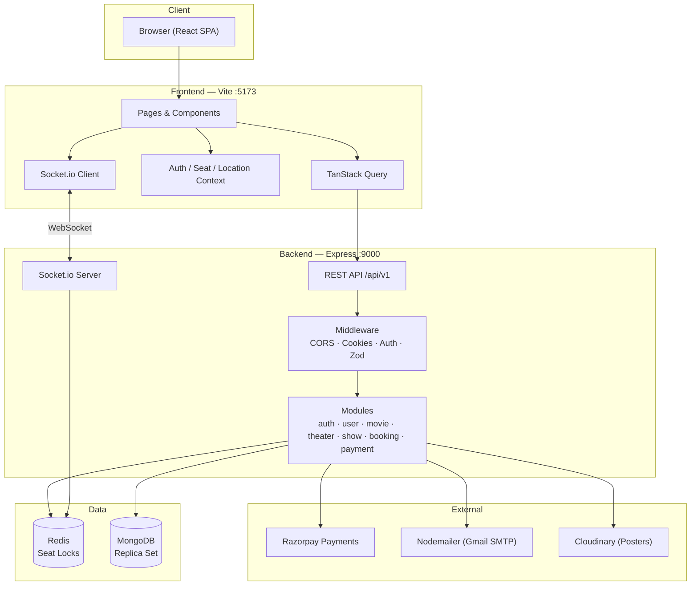
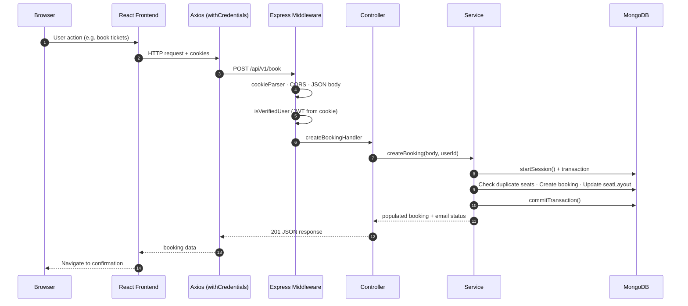
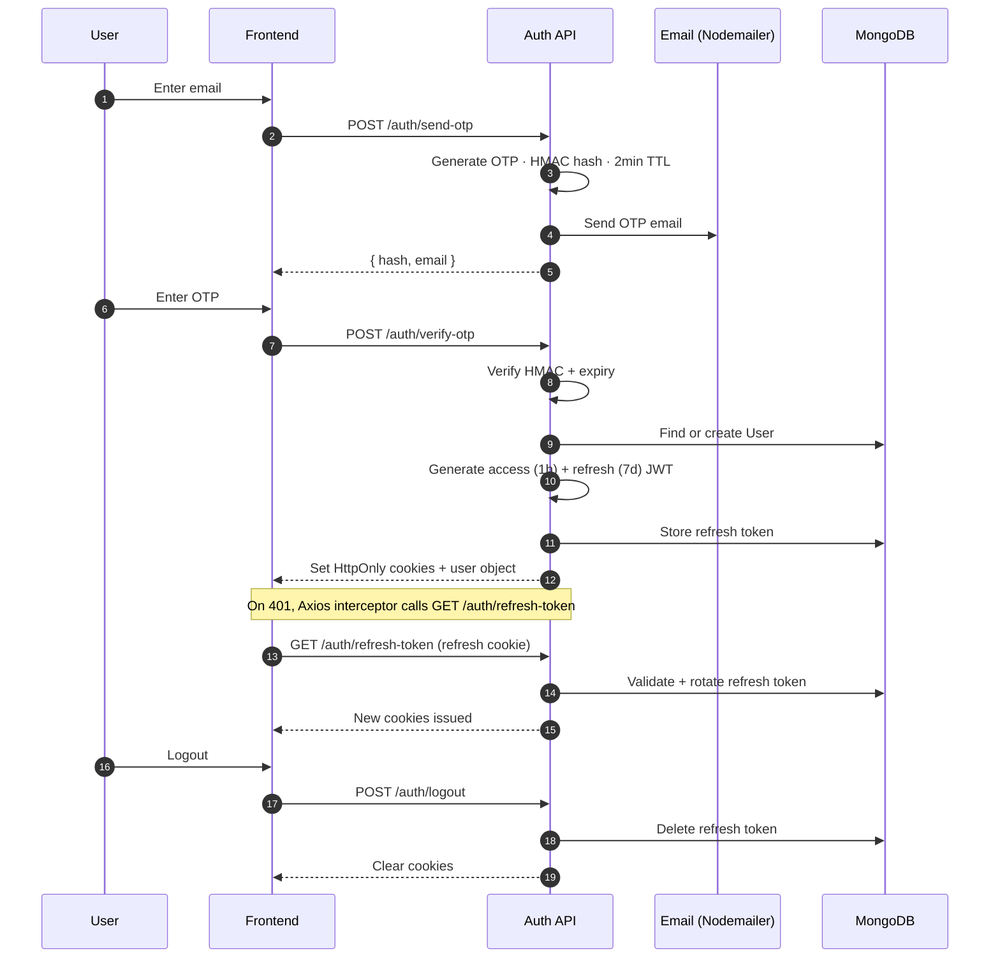
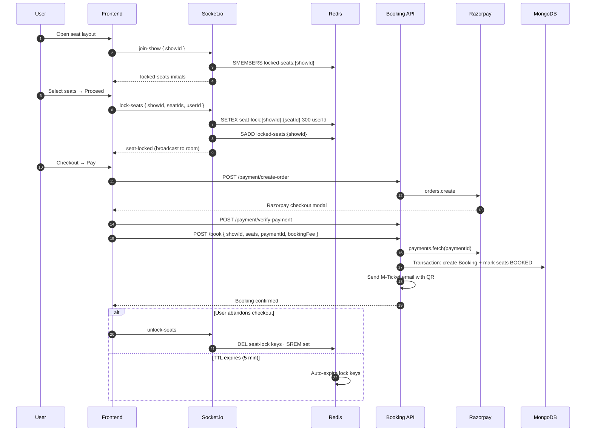
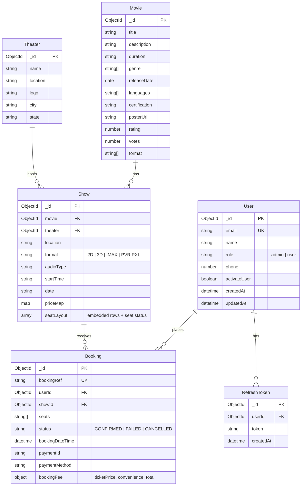
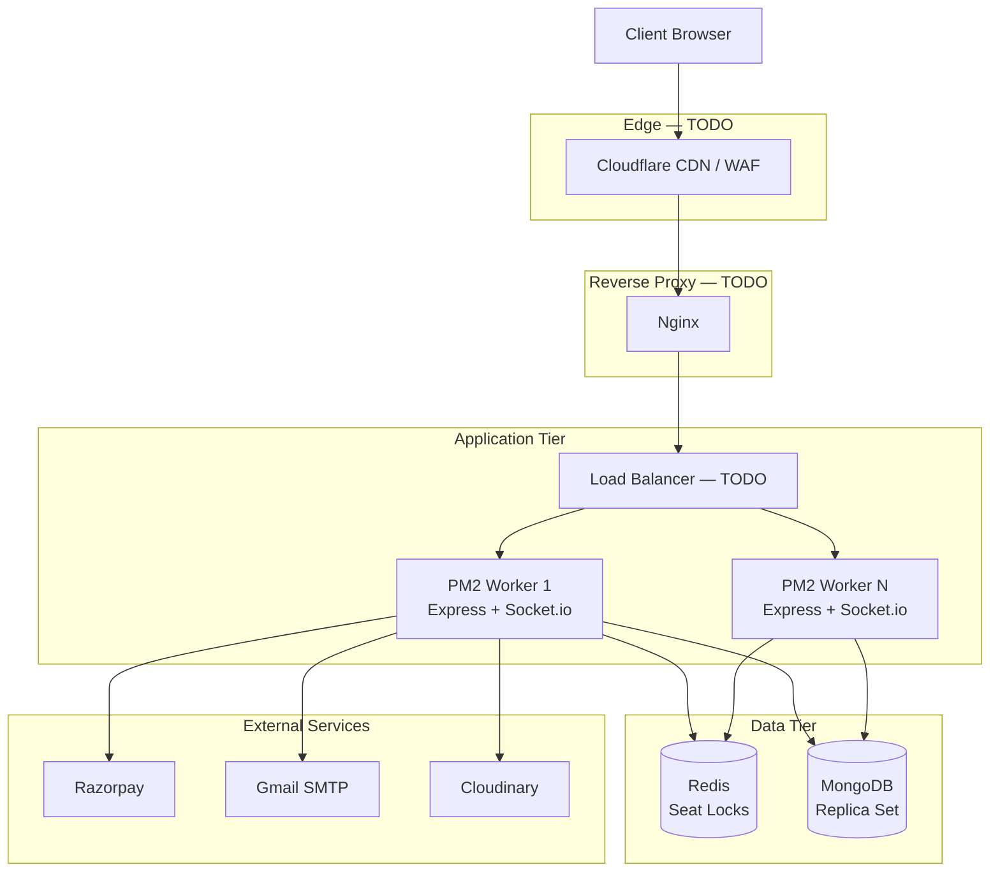
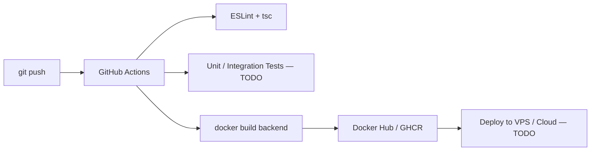

<div align="center">

<!-- Replace with your logo -->


# BookMyTheatre

**Real-time movie ticket booking — built like production, documented like open source.**

Discover movies, pick showtimes by city, lock seats in real time, pay with Razorpay, and receive QR-enabled M-Tickets by email.

<!-- Replace with a wide banner image (recommended: 1280×320) -->
<!--  -->
<picture>
  <source media="(prefers-color-scheme: dark)" srcset="./images/banner-dark.png" />
  
</picture>

<br />

[](./backend/package.json)
[](https://nodejs.org/)
[](./backend/tsconfig.json)
[](./backend/Dockerfile)
[](./backend/src/config/redis.ts)
[](./docker-compose.yml)
[](./frontend/package.json)
[](#cicd)
[](#)

[Features](#-features) · [Tech Stack](#-tech-stack) · [System Design](#-system-design) · [API Docs](#-api-documentation) · [Installation](#-installation) · [Contributing](#-contributing)

</div>

---

## Table of Contents

- [Preview](#-preview)
- [Features](#-features)
  - [User Features](#user-features)
  - [Admin Features](#admin-features)
  - [Developer Features](#developer-features)
  - [Performance Features](#performance-features)
  - [Security Features](#security-features)
  - [Scalability Features](#scalability-features)
- [Tech Stack](#-tech-stack)
- [Folder Structure](#-folder-structure)
- [System Design](#-system-design)
  - [High-Level Architecture](#high-level-architecture)
  - [Request Lifecycle](#request-lifecycle)
  - [Authentication Flow](#authentication-flow)
  - [Booking & Seat Lock Flow](#booking--seat-lock-flow)
  - [Database Design](#database-design)
- [API Documentation](#-api-documentation)
- [Installation](#-installation)
- [Environment Variables](#-environment-variables)
- [Docker](#-docker)
- [Redis Strategy](#-redis-strategy)
- [Queue Strategy](#-queue-strategy)
- [Security](#-security)
- [Performance Optimizations](#-performance-optimizations)
- [Deployment Architecture](#-deployment-architecture)
- [CI/CD](#-cicd)
- [Monitoring](#-monitoring)
- [Scaling Strategy](#-scaling-strategy)
- [Future Improvements](#-future-improvements)
- [Screenshots](#-screenshots)
- [Contributing](#-contributing)
- [License](#-license)
- [Author](#-author)

---

## Preview

> **Developer note:** Replace placeholder paths below with actual screenshots after capturing the running app.

| Home | Login (OTP) |
|:---:|:---:|
|  |  |

| Dashboard / Profile | Mobile |
|:---:|:---:|
|  |  |

---

## Features

### User Features

- ✅ Passwordless **OTP login** via email (2-minute expiry, HMAC-hashed)
- ✅ **JWT authentication** with HttpOnly cookies
- ✅ **Automatic token refresh** on 401 (Axios interceptor)
- ✅ Browse **recommended movies** (top 5 by votes)
- ✅ **Search movies** by title, genre, or language
- ✅ **Location-aware** show discovery (state + date filters)
- ✅ Interactive **seat layout** with Premium / Executive / Normal tiers
- ✅ **Real-time seat locking** via Socket.io + Redis (5-minute hold)
- ✅ **Razorpay** payment integration (order creation + signature verification)
- ✅ **MongoDB transactions** for atomic booking + seat updates
- ✅ **M-Ticket** confirmation page with QR code
- ✅ **Email ticket delivery** with branded HTML + QR code
- ✅ **PDF ticket download** (jsPDF + html2canvas)
- ✅ **Booking history** in user profile
- ✅ **Resend ticket email** from booking details
- ✅ Profile activation flow (name + phone after first login)

### Admin Features

- ✅ **Role schema** (`admin` \| `user`) on User model
- ✅ Create movies, theaters, and shows via REST API
- ✅ **Zod validation** on movie and theater creation payloads
- ✅ Database **seed scripts** for movies, theaters, and shows
- ⬜ Admin-only route guards — **TODO** (role exists; middleware not enforced)
- ⬜ Admin dashboard UI — **TODO**

### Developer Features

- ✅ **Modular monolith** backend (`auth`, `user`, `movie`, `theater`, `show`, `booking`, `payment`)
- ✅ **TypeScript** backend with strict module boundaries (controller → service → model)
- ✅ **Zod** runtime validation + centralized error handler
- ✅ **Express 5** with global error middleware
- ✅ **React 19 + Vite 7** frontend with TanStack Query
- ✅ **Socket.io** real-time layer co-located with HTTP server
- ✅ **Multi-stage Docker** build with PM2 cluster mode
- ✅ **Seed scripts** for local development data
- ✅ Image **proxy endpoint** with HTTP caching headers
- ✅ `.env.example` files for backend and frontend

### Performance Features

- ✅ **Redis TTL-based** seat locks (auto-expire after 5 minutes)
- ✅ **TanStack Query** caching (`staleTime: 10s` default)
- ✅ **MongoDB indexes** on `Booking.userId` and `Booking.showId`
- ✅ **Image proxy** `Cache-Control: public, max-age=3600`
- ✅ **PM2 cluster** (`instances: "max"`) for multi-core utilization
- ✅ Show grouping aggregation in service layer (theater + movie grouping)
- ✅ `keepPreviousData` on seat layout query for smoother UX

### Security Features

- ✅ **HttpOnly + Secure + SameSite** cookies for tokens
- ✅ **Refresh token rotation** stored in MongoDB
- ✅ **HMAC-SHA256** OTP hashing with server secret
- ✅ **Razorpay HMAC** payment signature verification
- ✅ **CORS** restricted to frontend origin with credentials
- ✅ **Zod schema validation** on write endpoints (movies, theaters)
- ✅ Protected routes via `isVerifiedUser` middleware
- ⬜ Helmet — **TODO**
- ⬜ Rate limiting — **TODO**
- ⬜ CSRF protection — **TODO**

### Scalability Features

- ✅ **Stateless API** design (JWT in cookies, refresh tokens in DB)
- ✅ **Redis-backed** distributed seat locking (works across PM2 workers)
- ✅ **Socket.io rooms** per show (`join-show` → room = `showId`)
- ✅ **MongoDB replica set** support for multi-document ACID transactions
- ✅ **PM2 horizontal process scaling** within a single host
- ⬜ Dedicated Redis / MongoDB in docker-compose — **TODO**
- ⬜ CDN + load balancer deployment — **TODO** (documented in deployment section)

---

## Tech Stack

| Layer | Technology | Purpose |
|:---|:---|:---|
| **Frontend** | React 19, Vite 7, Tailwind CSS 4 | SPA UI, routing, styling |
| **State / Data** | TanStack Query 5, React Context | Server state, auth, seats, location |
| **Backend** | Node.js 20, Express 5, TypeScript 5 | REST API, business logic |
| **Database** | MongoDB 6 + Mongoose 8 | Movies, shows, bookings, users |
| **Cache** | Redis (ioredis 5) | Real-time seat lock keys + sets |
| **Queue** | — | **Not implemented** (see [Queue Strategy](#-queue-strategy)) |
| **Real-time** | Socket.io 4 | Seat lock / unlock broadcasts |
| **Authentication** | JWT, OTP (Nodemailer), HttpOnly cookies | Passwordless login + session |
| **Payments** | Razorpay | Order creation, capture verification |
| **Email** | Nodemailer + Mailgen + custom HTML | OTP + M-Ticket delivery |
| **Storage** | Cloudinary (poster URLs) | Movie poster images |
| **PDF / QR** | jsPDF, html2canvas, qrcode | Ticket download + QR generation |
| **Validation** | Zod 3 | Request body validation |
| **Deployment** | Docker, PM2, docker-compose | Containerized backend + local Mongo RS |
| **Monitoring** | Console logging | **TODO:** structured logs, metrics, alerts |
| **CI/CD** | — | **TODO:** GitHub Actions |

---

## Folder Structure

```
bookMyTheatre/
├── backend/                          # Express + TypeScript API server
│   ├── src/
│   │   ├── app.ts                    # Express app, CORS, middleware, routes mount
│   │   ├── server.ts                 # HTTP server, Socket.io, DB + Redis bootstrap
│   │   ├── config/
│   │   │   ├── config.ts             # Frozen env config object
│   │   │   ├── db.ts                 # Mongoose connection
│   │   │   └── redis.ts              # ioredis client
│   │   ├── middlewares/
│   │   │   ├── auth.middleware.ts    # JWT cookie verification
│   │   │   ├── error.middleware.ts   # Global Zod + Error handler
│   │   │   └── validate.ts           # Zod request validator wrapper
│   │   ├── modules/
│   │   │   ├── auth/                 # OTP, JWT, refresh tokens
│   │   │   ├── user/                 # User CRUD, profile activation
│   │   │   ├── movie/                # Movie catalog + search
│   │   │   ├── theater/              # Theater management
│   │   │   ├── show/                 # Showtimes + embedded seat layout
│   │   │   ├── booking/              # Booking creation, history, ticket email
│   │   │   └── payment/              # Razorpay order + verification
│   │   ├── routes/
│   │   │   ├── index.ts              # API v1 router aggregation
│   │   │   └── proxy.route.ts        # Image proxy with cache headers
│   │   ├── socket/
│   │   │   └── sockethandlers.ts     # join-show, lock-seats, unlock-seats
│   │   ├── scripts/
│   │   │   ├── seed-movies.ts        # Seed movie catalog
│   │   │   ├── seed-theaters.ts      # Seed theater data
│   │   │   └── seed-shows.ts         # Seed showtimes + seat layouts
│   │   └── utils/
│   │       ├── index.ts              # Seat layout generator, booking ref, grouping
│   │       ├── mailer.ts             # Shared Nodemailer transport
│   │       └── imageProxy.ts         # Fetch + buffer external images
│   ├── Dockerfile                    # Multi-stage Node 20 Alpine + PM2
│   ├── ecosystem.config.js           # PM2 cluster configuration
│   ├── .env.example                  # Backend environment template
│   └── package.json
│
├── frontend/                         # React SPA (Vite)
│   ├── src/
│   │   ├── apis/                     # Axios wrapper + API functions
│   │   ├── components/               # UI components (auth, booking, movies, seats)
│   │   ├── context/                  # Auth, Location, Seat React contexts
│   │   ├── hooks/                    # useLoadUser, useCountdown, etc.
│   │   ├── pages/                    # Route-level pages
│   │   └── utils/                    # Socket client, PDF, constants
│   ├── public/                       # Static assets (logo SVG)
│   ├── .env.example                  # VITE_BACKEND_URL template
│   └── package.json
│
├── docker-compose.yml                # MongoDB replica set (rs0) for transactions
├── SETUP_GUIDE.md                    # Quick local setup walkthrough
├── MONGO.TXT                         # Notes on why replica set is required
└── README.md                         # You are here
```

| Path | Description |
|:---|:---|
| `backend/src/modules/*` | Domain-driven modules — each owns routes, controller, service, model |
| `backend/src/socket/` | Real-time seat locking handlers backed by Redis |
| `backend/src/scripts/` | One-off seeders for local/dev database population |
| `frontend/src/pages/` | Top-level routes: Home, Movies, SeatLayout, Checkout, Profile |
| `frontend/src/context/` | Cross-cutting client state (auth session, selected seats, geo) |
| `docker-compose.yml` | Spins up MongoDB 6 with replica set initialization |

---

## System Design

### High-Level Architecture



### Request Lifecycle



### Authentication Flow



### Booking & Seat Lock Flow



### Database Design



**Seat layout** is embedded inside each `Show` document as an array of rows (`K`–`A`) with per-seat `status`: `AVAILABLE` | `BOOKED` | `BLOCKED`.

**Seat tiers & pricing** (generated by `generateSeatLayout()`):

| Tier | Rows | Price (₹) | Seats/Row |
|:---|:---|---:|---:|
| PREMIUM | K, J | 510 | 18 |
| EXECUTIVE | I–D | 290 | 24 |
| NORMAL | C–A | 180 | 24 |

---

## API Documentation

Base URL: `http://localhost:9000/api/v1`

### Auth

| Method | Endpoint | Description | Auth | Example |
|:---|:---|:---|:---:|:---|
| `POST` | `/auth/send-otp` | Send 4-digit OTP to email | No | `{ "email": "user@example.com" }` |
| `POST` | `/auth/verify-otp` | Verify OTP, issue JWT cookies, create user if new | No | `{ "email", "otp", "hash" }` |
| `GET` | `/auth/refresh-token` | Rotate access + refresh tokens | Cookie | — |
| `POST` | `/auth/logout` | Invalidate refresh token, clear cookies | Yes | — |

### Users

| Method | Endpoint | Description | Auth | Example |
|:---|:---|:---|:---:|:---|
| `POST` | `/users` | Create user | No | `{ "email", "name" }` |
| `GET` | `/users` | List all users | No | — |
| `GET` | `/users/me` | Get current authenticated user | Yes | — |
| `PUT` | `/users/activate/:id` | Activate profile (name, phone) | Yes | `{ "name", "phone" }` |

### Movies

| Method | Endpoint | Description | Auth | Example |
|:---|:---|:---|:---:|:---|
| `GET` | `/movies` | List movies (optional `?search=`) | No | `/movies?search=avatar` |
| `GET` | `/movies/recommended` | Top 5 movies by votes | No | — |
| `GET` | `/movies/:id` | Get movie by ID | No | — |
| `POST` | `/movies` | Create movie (Zod validated) | No | Movie body |

### Theaters

| Method | Endpoint | Description | Auth | Example |
|:---|:---|:---|:---:|:---|
| `GET` | `/theaters` | List theaters | No | — |
| `POST` | `/theaters` | Create theater (Zod validated) | No | Theater body |

### Shows

| Method | Endpoint | Description | Auth | Example |
|:---|:---|:---|:---:|:---|
| `GET` | `/shows` | Shows by movie, date, state | No | `?movieId=&state=&date=` |
| `GET` | `/shows/:id` | Show with seat layout (populated) | No | — |
| `POST` | `/shows` | Create show (auto-generates seat layout) | No | Show body |

### Payment

| Method | Endpoint | Description | Auth | Example |
|:---|:---|:---|:---:|:---|
| `POST` | `/payment/create-order` | Create Razorpay order | Yes | `{ "amount": 500 }` |
| `POST` | `/payment/verify-payment` | Verify Razorpay signature | Yes | Razorpay callback fields |

### Bookings

| Method | Endpoint | Description | Auth | Example |
|:---|:---|:---|:---:|:---|
| `POST` | `/book` | Confirm booking after payment | Yes | `{ showId, seats, paymentId, bookingFee }` |
| `GET` | `/book` | List current user's bookings | Yes | — |
| `GET` | `/book/:id` | Get booking by ID | Yes | — |
| `POST` | `/book/:id/resend-email` | Resend M-Ticket email | Yes | — |

### Utility

| Method | Endpoint | Description | Auth | Example |
|:---|:---|:---|:---:|:---|
| `GET` | `/proxy-image?url=` | Proxy external images with cache headers | No | Poster URLs |

### Socket.io Events

| Event | Direction | Payload | Description |
|:---|:---|:---|:---|
| `join-show` | Client → Server | `{ showId }` | Join show room; receive current locks |
| `locked-seats-initials` | Server → Client | `{ seatIds }` | Initial locked seat list |
| `lock-seats` | Client → Server | `{ showId, seatIds, userId }` | Lock seats for 5 minutes |
| `seat-locked` | Server → Room | `{ showId, seatIds, userId }` | Broadcast successful lock |
| `seat-locked-failed` | Server → Client | `{ alreadyLocked }` | Conflict response |
| `unlock-seats` | Client → Server | `{ showId, seatIds, userId }` | Release locks manually |

---

## Installation

### Prerequisites

| Tool | Version |
|:---|:---|
| Node.js | 20.x |
| npm | 9+ |
| MongoDB | 6.x (replica set — see below) |
| Redis | 6+ (required for seat locking) |
| Gmail App Password | For OTP + ticket emails |
| Razorpay | Test/Live API keys |

### 1. Clone the repository

```bash
git clone https://github.com/<your-username>/bookMyTheatre.git
cd bookMyTheatre
```

### 2. Start MongoDB replica set (Docker)

MongoDB **multi-document transactions** (used in booking) require a replica set:

```bash
docker compose up -d
```

This starts MongoDB 6 with `--replSet rs0` and runs the one-shot `mongo-init` service.

> See [MONGO.TXT](./MONGO.TXT) for why replica set is required.

### 3. Start Redis

Redis is required but **not yet included in docker-compose** — run locally:

```bash
# macOS (Homebrew)
brew services start redis

# Docker (manual)
docker run -d --name redis -p 6379:6379 redis:7-alpine
```

### 4. Backend setup

```bash
cd backend
cp .env.example .env
# Fill in all required values (see Environment Variables section)
npm install
npm run seed:theaters
npm run seed:movies
npm run seed:shows
npm run dev
```

Backend runs at **http://localhost:9000**

### 5. Frontend setup

```bash
cd frontend
cp .env.example .env
npm install
npm run dev
```

Frontend runs at **http://localhost:5173**

### 6. Fix Socket.io URL (required for seat locking)

Update `frontend/src/utils/socket.js` to point at the backend port:

```javascript
// TODO: move to VITE_SOCKET_URL env variable
export const socket = io('http://localhost:9000');
```

> **Known issue:** The file currently hardcodes port `4000`; the backend listens on `9000`.

---

## Environment Variables

### Backend (`backend/.env`)

| Variable | Description | Example | Required |
|:---|:---|:---|:---:|
| `PORT` | HTTP server port | `9000` | Yes |
| `MONGO_CONNECTION_STRING` | MongoDB connection URI | `mongodb://localhost:27017/bookmytheatre` | Yes |
| `MONGO_REPLICA_STRING` | Replica set URI (for transactions) | `mongodb://localhost:27017/bookmytheatre?replicaSet=rs0` | Yes |
| `REDIS_HOST` | Redis hostname | `localhost` | Yes |
| `REDIS_PORT` | Redis port | `6379` | Yes |
| `ACCESS_TOKEN_SECRET` | JWT access token secret | `your-access-secret` | Yes |
| `REFRESH_TOKEN_SECRET` | JWT refresh token secret | `your-refresh-secret` | Yes |
| `HASH_SECRET` | HMAC secret for OTP hashing | `your-hash-secret` | Yes |
| `NODEMAILER_EMAIL` | Gmail address for sending mail | `you@gmail.com` | Yes |
| `NODEMAILER_PASSWORD` | Gmail app password | `xxxx xxxx xxxx xxxx` | Yes |
| `FRONTEND_URL` | Frontend base URL (ticket links) | `http://localhost:5173` | Yes |
| `RAZORPAY_API_KEY` | Razorpay key ID | `rzp_test_xxx` | Yes |
| `RAZORPAY_SECRET_KEY` | Razorpay key secret | `xxx` | Yes |

### Frontend (`frontend/.env`)

| Variable | Description | Example | Required |
|:---|:---|:---|:---:|
| `VITE_BACKEND_URL` | Backend API base URL | `http://localhost:9000/api/v1` | Yes |

---

## Docker

### Backend Dockerfile

Multi-stage build targeting **Node 20 Alpine**:

| Stage | What it does |
|:---|:---|
| **Builder** | `npm ci` → `npm run build` (TypeScript → `dist/`) |
| **Production** | `npm ci --omit=dev` → copy `dist/` → install PM2 globally |

```dockerfile
# Simplified overview — see backend/Dockerfile for full file
FROM node:20-alpine AS builder
WORKDIR /app
COPY package*.json ./
RUN npm ci && COPY . . && npm run build

FROM node:20-alpine
WORKDIR /app
COPY package*.json ./
RUN npm ci --omit=dev
COPY --from=builder /app/dist ./dist
RUN npm install pm2 -g
COPY ecosystem.config.js .
USER node
EXPOSE 9000
CMD ["pm2-runtime", "start", "ecosystem.config.js"]
```

**Build & publish** (from `backend/package.json`):

```bash
cd backend
npm run docker:publish
# Builds aashish909/bmt-backend:v1 for linux/amd64 and pushes to Docker Hub
```

### docker-compose.yml

| Service | Image | Purpose |
|:---|:---|:---|
| `mongo` | `mongo:6` | Primary DB with `--replSet rs0` |
| `mongo-init` | `mongo:6` | One-shot replica set initialization |

| Resource | Status |
|:---|:---|
| **Networks** | Default bridge (implicit) |
| **Volumes** | **TODO** — MongoDB data is ephemeral without a named volume |
| **Redis container** | **TODO** — not yet in compose |
| **Backend container** | **TODO** — Dockerfile exists; not wired into compose |
| **Frontend container** | **TODO** |

---

## Redis Strategy

Redis is used exclusively for **real-time seat locking** — not for JWT sessions or general API caching.

### Key Schema

| Key Pattern | Type | TTL | Value |
|:---|:---|---:|:---|
| `seat-lock:{showId}:{seatId}` | String | 300s (5 min) | `userId` |
| `locked-seats:{showId}` | Set | — | All locked `seatId`s for a show |

### Flow

1. **Lock:** `SETEX` per seat + `SADD` to show set
2. **Join room:** `SMEMBERS` set → verify each key still exists (cleanup stale entries)
3. **Unlock:** `DEL` key + `SREM` from set
4. **Auto-expire:** TTL releases abandoned locks; disconnect does **not** immediately unlock (by design)

### Invalidation

| Trigger | Action |
|:---|:---|
| User completes checkout | Seats marked `BOOKED` in MongoDB; Redis locks should be released client-side |
| User abandons checkout | Client emits `unlock-seats` |
| 5-minute timeout | Redis TTL auto-expires |
| Checkout timer (frontend) | 300s countdown → emit `unlock-seats` → redirect home |

### Performance Benefit

Prevents double-booking race conditions during the checkout window without hitting MongoDB on every seat click. Broadcasts lock state to all users in the same show room via Socket.io.

---

## Queue Strategy

**Not implemented in the current codebase.**

Email sending (OTP + M-Ticket) runs **inline** in the request lifecycle. For production hardening, consider:

| Component | Proposed Role |
|:---|:---|
| **Producer** | Booking controller enqueues `send-ticket-email` job |
| **Consumer** | Worker process sends email via Nodemailer |
| **Retry** | Exponential backoff (3 attempts) |
| **Dead Letter Queue** | Failed jobs after max retries → manual review |

**Recommended stack:** BullMQ + Redis (reuse existing Redis instance).

---

## Security

| Control | Status | Implementation |
|:---|:---:|:---|
| JWT access tokens | ✅ | 1-hour expiry, HttpOnly cookie |
| JWT refresh tokens | ✅ | 7-day expiry, stored + rotated in MongoDB |
| OTP hashing | ✅ | HMAC-SHA256 with `HASH_SECRET` |
| Password storage | N/A | Passwordless OTP-only auth |
| HttpOnly cookies | ✅ | `accessToken`, `refreshToken` |
| Secure + SameSite cookies | ✅ | `secure: true`, `sameSite: 'none'` |
| CORS | ✅ | Whitelist frontend origin, `credentials: true` |
| Payment verification | ✅ | Razorpay HMAC signature check |
| Input validation | ✅ | Zod on movie/theater creation |
| Helmet | ⬜ TODO | Security headers |
| Rate limiting | ⬜ TODO | Protect `/auth/send-otp` |
| CSRF | ⬜ TODO | Consider for cookie-based auth |
| RBAC enforcement | ⬜ TODO | `admin` role exists but routes are open |
| Sanitization | Partial | Zod parsing; no HTML sanitization library |

---

## Performance Optimizations

| Optimization | Where | Impact |
|:---|:---|:---|
| Redis seat locks | `sockethandlers.ts` | O(1) lock checks vs. DB writes per click |
| MongoDB transactions | `booking.service.ts` | Atomic booking + seat update |
| Compound indexes | `booking.model.ts` | Faster user/show booking lookups |
| TanStack Query cache | `main.jsx` | Reduces redundant API calls (`staleTime: 10s`) |
| Show grouping | `show.service.ts` | Server-side theater grouping reduces client work |
| Image proxy caching | `proxy.route.ts` | 1-hour CDN-like cache for poster images |
| PM2 cluster | `ecosystem.config.js` | Multi-core CPU utilization |
| Embedded seat layout | `show.model.ts` | Single read for seat map + show metadata |
| `keepPreviousData` | `SeatLayout.jsx` | Prevents layout flash on refetch |

---

## Deployment Architecture



**Current state:** Backend Dockerfile + PM2 config exist. Full production stack (Nginx, Cloudflare, managed MongoDB/Redis) is documented as the target architecture.

**Socket.io note:** With multiple PM2 instances, configure a **Redis adapter** for Socket.io so lock broadcasts reach all workers. **TODO.**

---

## CI/CD

**Not configured.** Recommended pipeline:



| Stage | Tool | Status |
|:---|:---|:---:|
| Lint | ESLint (frontend) | Partial |
| Type check | `tsc --noEmit` | TODO |
| Test | Jest / Vitest | TODO |
| Docker build | `backend/Dockerfile` | Ready |
| Deploy | PM2 / Kubernetes | TODO |

---

## Monitoring

| Capability | Status | Notes |
|:---|:---:|:---|
| Application logs | ✅ | `console.log` / `console.error` |
| Health check endpoint | ⬜ TODO | Add `GET /health` |
| Structured logging | ⬜ TODO | Pino / Winston |
| Metrics | ⬜ TODO | Prometheus + Grafana |
| Error tracking | ⬜ TODO | Sentry |
| Uptime alerts | ⬜ TODO | UptimeRobot / Better Stack |
| Redis monitoring | ⬜ TODO | `INFO memory`, connected clients |

---

## Scaling Strategy

| Strategy | Approach |
|:---|:---|
| **Horizontal scaling** | Multiple PM2 instances behind Nginx load balancer; add Socket.io Redis adapter |
| **Vertical scaling** | Increase CPU/RAM for MongoDB and Node processes |
| **Stateless servers** | JWT in cookies; refresh tokens in MongoDB; no in-memory sessions |
| **Redis sessions** | Seat locks only — not used for auth sessions |
| **Queue workers** | **TODO** — offload email to background workers |
| **CDN** | Serve frontend static build via Cloudflare; proxy poster images |
| **Database** | MongoDB replica set (already required); consider sharding at scale |
| **Read replicas** | Route movie/show reads to secondary nodes — **TODO** |

---

## Future Improvements

| Priority | Item |
|:---|:---|
| 🔴 High | Fix Socket.io URL + add `VITE_SOCKET_URL` env variable |
| 🔴 High | Add Redis to `docker-compose.yml` |
| 🔴 High | Admin RBAC middleware for write endpoints |
| 🟡 Medium | GitHub Actions CI (lint, typecheck, Docker build) |
| 🟡 Medium | Helmet + rate limiting on auth routes |
| 🟡 Medium | Socket.io Redis adapter for PM2 cluster |
| 🟡 Medium | BullMQ for async email delivery |
| 🟡 Medium | `GET /health` + `GET /ready` endpoints |
| 🟡 Medium | Frontend Dockerfile + full compose stack |
| 🟢 Low | Admin dashboard for movies/theaters/shows |
| 🟢 Low | Wishlist, reviews, and seat recommendations |
| 🟢 Low | Multi-city geolocation (beyond state filter) |
| 🟢 Low | Migrate license to MIT + add `LICENSE` file |
| 🟢 Low | E2E tests with Playwright |

---

## Screenshots

> Replace these placeholders with real captures from your running instance.

| # | Screen | Placeholder |
|:---:|:---|:---:|
| 1 | Homepage — hero + recommended |  |
| 2 | Movie listing + search |  |
| 3 | Showtimes by theater |  |
| 4 | Interactive seat layout |  |
| 5 | Checkout + Razorpay |  |
| 6 | M-Ticket confirmation + QR |  |
| 7 | Profile + booking history |  |
| 8 | OTP email (inbox) |  |

---

## Contributing

Contributions are welcome. Please follow these steps:

1. **Fork** the repository and create a feature branch from `main`
   ```bash
   git checkout -b feat/your-feature-name
   ```

2. **Set up locally** — follow the [Installation](#-installation) guide (MongoDB replica set + Redis required)

3. **Follow conventions**
   - Backend: TypeScript, module pattern (`*.route.ts` → `*.controller.ts` → `*.service.ts` → `*.model.ts`)
   - Frontend: React functional components, TanStack Query for server state
   - Validate request bodies with Zod on new write endpoints
   - Run `npm run build` in `backend/` before submitting

4. **Commit style** — use clear, imperative messages:
   ```
   feat(booking): add cancel booking endpoint
   fix(auth): handle expired OTP gracefully
   ```

5. **Open a Pull Request** with:
   - Summary of changes
   - Screenshots (for UI changes)
   - Test plan checklist

6. **Do not commit** `.env` files, secrets, or `node_modules`

---

## License

This project is licensed under the **ISC License** (see [`backend/package.json`](./backend/package.json)).

> **TODO:** Add a root `LICENSE` file. If migrating to MIT, update `package.json` and this section.

---

## Author

<table>
  <tr>
    <td>
      <strong>Aashish Kumar</strong><br />
      Full-stack engineer · Movie booking platforms · Real-time systems
    </td>
  </tr>
</table>

| | |
|:---|:---|
| **Project** | BookMyTheatre — Production-grade movie ticket booking |
| **Stack highlight** | React 19 · Express 5 · MongoDB transactions · Redis seat locks · Socket.io · Razorpay |
| **GitHub** | `https://github.com/<your-username>/bookMyTheatre` <!-- TODO: replace --> |
| **Docker Hub** | [`aashish909/bmt-backend`](https://hub.docker.com/r/aashish909/bmt-backend) |
| **LinkedIn** | <!-- TODO: add your LinkedIn URL --> |

---

<div align="center">

**If this project helped you, consider giving it a star.**

Built with care for developers, recruiters, and the open-source community.

</div>
